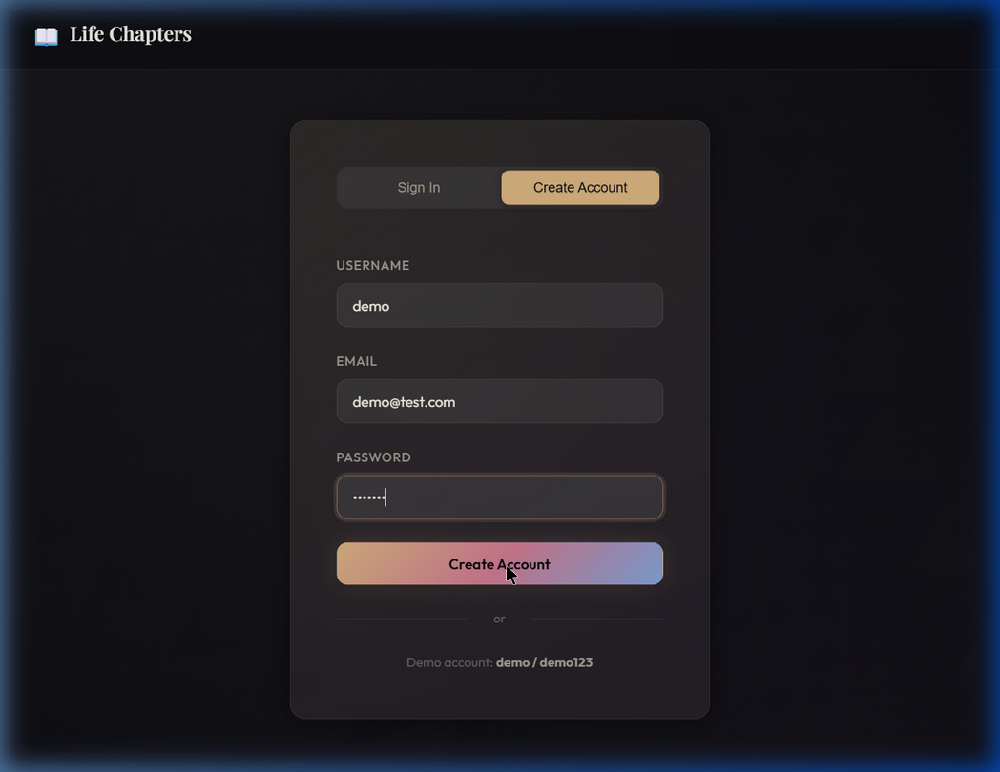
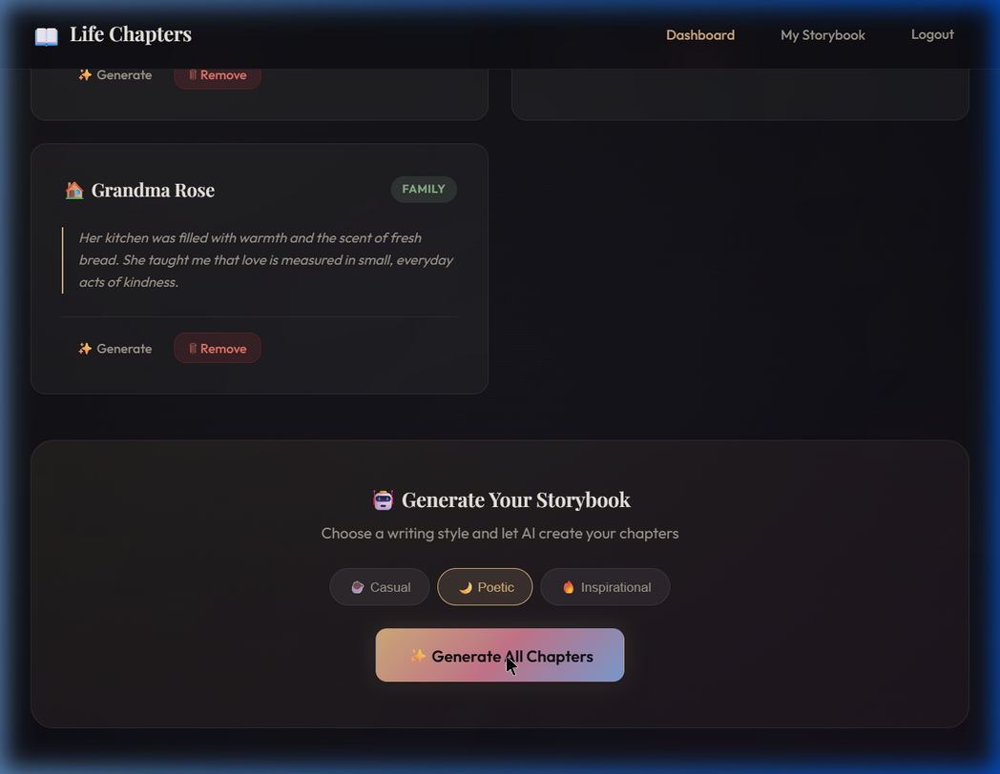
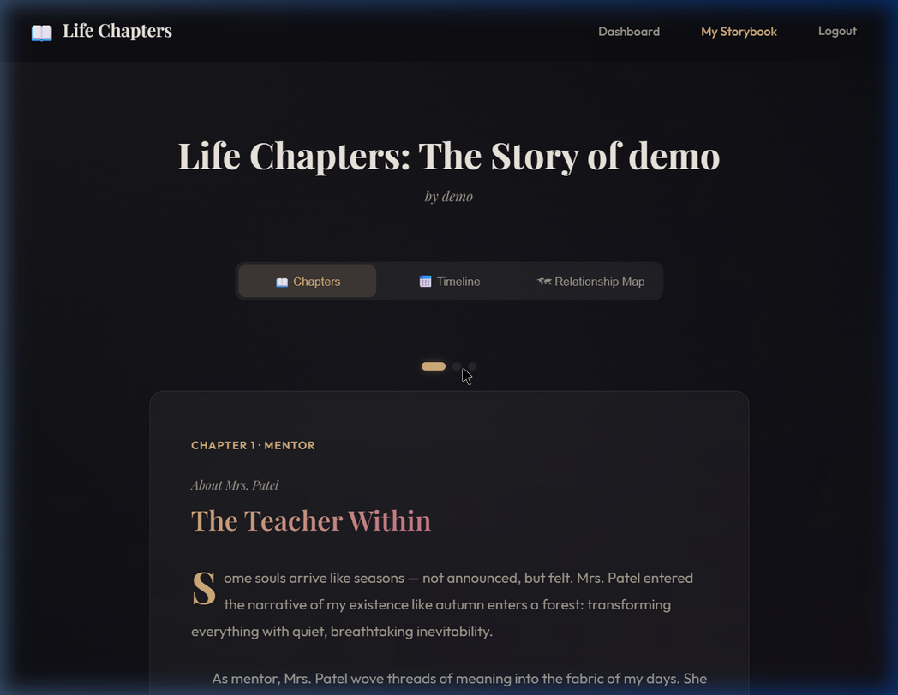
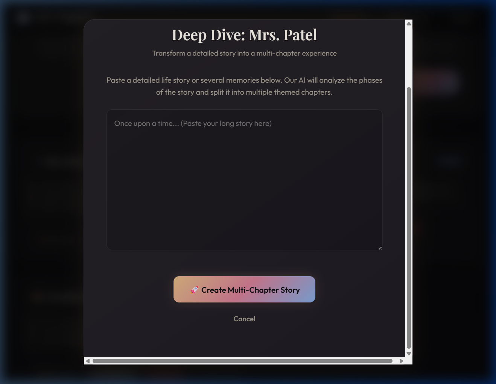

# Life Chapters – AI Storybook Generator | Walkthrough

## What Was Built

A full-stack demo application where users create personal storybooks based on people who influenced their lives. The app covers the complete flow: **user input → AI-generated chapters → assembled storybook → export**.

### Tech Stack
- **Backend:** Node.js + Express, SQLite (via sql.js), bcryptjs, express-session
- **Frontend:** Vanilla HTML/CSS/JS, Playfair Display + Outfit fonts, glassmorphism dark theme
- **AI Engine:** Template-based narrative generator with 3 styles (casual, poetic, inspirational)
- **Export:** jsPDF for PDF generation

---

## Demo Flow

### 1. Auth Page – Register/Login

### 2. Dashboard – Add People & Generate

### 3. Storybook Reader

---

## Deep Dive Feature (NEW)

The **Deep Dive** feature transforms a long life story about one person into a multi-chapter storybook. It analyzes the narrative, identifies different phases (first meeting, conflict, lesson learned, resolution), and generates separate chapters for each.

### How It Works
1. Click **🚀 Deep Dive** on any person card
2. Paste a detailed story in the modal
3. Click **Create Multi-Chapter Story**
4. The AI splits the story into themed chapters automatically

### Deep Dive Modal (Refined)

### Result: Multi-Chapter Storybook (7 chapters)

---

## Files Modified for Deep Dive

| File | Change |
|------|--------|
| [generator.js](../ai/generator.js) | Added `expandDeepDive()`, `generateSceneTitle()`, `enhanceScene()` |
| [chapters.js](../routes/chapters.js) | Added `POST /api/chapters/deep-dive` endpoint |
| [dashboard.html](../public/dashboard.html) | Deep Dive modal + button on cards + JS logic |
| [style.css](../public/css/style.css) | Modal overlay, content, and textarea styles |

---

## Deployment Status

**GitHub Repository:** [https://github.com/amruthav0607/ai-story.git](https://github.com/amruthav0607/ai-story.git)

The project has been successfully initialized as a Git repository and pushed to the main branch.

## Verification Results

- ✅ Deep Dive modal opens with person name
- ✅ Long story accepted (5 paragraphs → 5 chapters)
- ✅ Chapters have thematic titles ("The First Encounter", "The Hardest Lesson", etc.)
- ✅ Storybook shows 7 total chapters with dot navigation
- ✅ Style selector works with Deep Dive (casual/poetic/inspirational)
- ✅ All original features still working (auth, add people, generate, PDF export)
